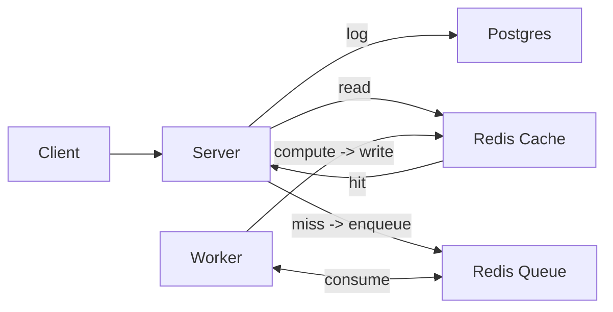

# Architecture

> High-level blueprint of the Fibonacci Learning Lab: components, topology, data flow, decisions, and operations.

## System Summary
This project is a small, service-oriented Fibonacci lab demonstrating async work offloading. It consists of three apps:

- Client: SvelteKit SPA that calls a backend API
- Server: Express API that validates requests, logs to Postgres, and coordinates work via Redis
- Worker: Long-running consumer that computes Fibonacci values and stores results in Redis

### Data Stores
- Redis
  - Job queue for indices to compute
  - Cache of computed Fibonacci values
  - Control keys (e.g., max computed index, stop token)
- Postgres
  - Aggregated metadata table tracking the count of requested indices

### Components and Responsibilities
- Client
  - Collects an index input, submits a calculation request, and polls for results
  - Displays the most requested index
- Server
  - Validates input (integer range, basic checks)
  - Persists the count of requests to Postgres
  - Deduplicates and enqueues compute jobs in Redis
  - Serves read endpoints for current result and most-requested index
- Worker
  - Consumes the Redis queue and computes missing Fibonacci values incrementally
  - Updates Redis cache and the max-index marker

## Topology and Data Flow
1) User submits an index from the client
2) Server validates and logs the request, then enqueues the job in Redis and marks the index as "Calculating..."
3) Worker picks the job from Redis, computes any missing values up to that index, and stores results back in Redis
4) User requests the server for the index:
   - If absent -> no result yet
   - If "Calculating..." -> still processing
   - If value present -> display result

## Reliability and Limits
- Atomic enqueue + deduplication to avoid duplicate work
- At-least-once processing with recovery of in-flight items on worker start
- Idempotent compute based on a tracked max-index to prevent recomputation
- Graceful shutdown for server and worker

For implementation details and code examples, see the individual service README files in `/client`, `/server`, and `/worker` directories.

### Limitations and trade-offs
- Range is intentionally restricted (e.g., 0-40) to limit CPU/time for demos
- Single logical queue; multiple workers can run, but no orchestration or priority
- Redis persistence not configured here; a restart may lose cache/max-index

### Runtime Topology (diagram)
- Services run as separate processes: `client`, `server`, `worker`
- Inter-service communication over HTTP and/or a database

## Configuration & Environments
- Each service has `.env.example` documenting required variables
- In local dev, copy to `.env` (do not commit secrets)

## Decisions and Rationale

### Goals and Constraints
- __Primary goals__: high reliability, fast delivery, predictable scaling, low ops burden.
- __Constraints__: small team, budget-aware, minimize bespoke infra, favor managed services and proven patterns.
- __Guiding principles__: stateless by default, security-first, build once-promote across envs.

### Component Decisions and Rationale

#### Frontend (SvelteKit SPA)
- __Decision__: SvelteKit for reactive UI with server-side rendering capabilities and built-in optimizations.
- __Why__:
  - Reactive framework provides efficient DOM updates for real-time Fibonacci result display.
  - Built-in stores for managing application state across components.
  - Excellent TypeScript support for type-safe development.
  - Small bundle size and fast runtime performance.
- __Implementation Details__:
  - Polling mechanism for checking computation status.
  - Optimistic UI updates when submitting requests.
  - Error boundary components for graceful error handling.

#### Backend API (Express Server)
- __Decision__: Express.js with middleware architecture for request processing pipeline.
- __Why__:
  - Lightweight and flexible for building RESTful APIs.
  - Rich ecosystem of middleware for common concerns (CORS, body parsing, validation).
  - Non-blocking I/O model aligns with async processing pattern.
- __Key Architectural Choices__:
  - Request validation middleware ensures only valid indices are processed.
  - Async route handlers for non-blocking database and Redis operations.
  - Structured error handling with custom error classes.
  - Request ID tracking for distributed tracing.

#### Worker Service (Async Processor)
- __Decision__: Long-running Node.js process with Redis-based job queue consumption.
- __Why__:
  - Decouples computation from API response time.
  - Allows for complex, long-running calculations without blocking.
  - Enables retry logic and error recovery.
- __Processing Architecture__:
  - Single-threaded event loop with async I/O for Redis operations.
  - Incremental computation strategy: builds on previously computed values.
  - Atomic operations ensure consistency in concurrent scenarios.
  - Graceful shutdown with in-flight job completion.
- __Algorithm Optimizations__:
  - Memoization through Redis cache avoids redundant calculations.
  - BigInt support for large Fibonacci numbers.
  - Batch processing capability for computing ranges efficiently.

#### Data Layer Architecture

##### PostgreSQL (Persistent Storage)
- __Decision__: Relational database for structured data and ACID guarantees.
- __Why__:
  - Strong consistency for request counting and analytics.
  - Proven reliability and ecosystem.

##### Redis (Cache & Queue)
- __Decision__: In-memory data structure store for caching and job queue.
- __Why__:
  - Sub-millisecond latency for cache lookups.
  - Native support for lists (queue) and hashes (cache).
  - Atomic operations for race condition prevention.
- __Key Design Patterns__:
  - Lua scripts for atomic multi-key operations.

## Cross-Cutting Implementation Notes

### Async Processing Patterns
- __Decision__: Event-driven architecture with message queue for work distribution.
- __Why__: Decouples request acceptance from processing, enabling better resource utilization.
- __Implementation__:
  - At-least-once delivery semantics with idempotent processing.
  - Dead letter queue for failed jobs after retry exhaustion.
  - Visibility timeout pattern to handle failures.

### Error Handling & Resilience
- __Decision__: Comprehensive error handling at each layer with appropriate recovery strategies.
- __Strategies__:
  - Client: Exponential backoff for polling, user-friendly error messages.
  - Server: Input validation, rate limiting, circuit breakers for downstream services.
  - Worker: Retry with jitter, poison message handling, graceful degradation.
- __Monitoring__:
  - Structured logging.
  - Error categorization.

### Performance Optimization
- __Decision__: Multi-level optimization from algorithm to infrastructure.
- __Techniques__:
  - Algorithm: Dynamic programming approach for Fibonacci computation.
  - Caching: Multi-tier cache (Redis for hot data, computed values persistence).
  - Database: Connection pooling, prepared statements, query optimization.
  - Network: Keep-alive connections, compression for API responses.
- __Benchmarks__:
  - Target: < 100ms API response time for cache hits.
  - Worker throughput: Process indices 0-40 in < 1 second.
  - Memory footprint: Bounded by max index range.

## Risks and Mitigations

### Technical Risks
- __Integer Overflow__: 
  - Risk: JavaScript Number type can't handle Fibonacci numbers > 78.
  - Mitigation: BigInt implementation for arbitrary precision.
  
- __Queue Overflow__:
  - Risk: Malicious or accidental flooding of calculation requests.
  - Mitigation: Rate limiting, deduplication, bounded queue size.
  
- __Cache Invalidation__:
  - Risk: Stale or incorrect cached values.
  - Mitigation: Immutable cache entries (Fibonacci values never change), versioned keys.

### Operational Risks  
- __Worker Failure__:
  - Risk: In-flight jobs lost if worker crashes.
  - Mitigation: Job recovery on startup, visibility timeout pattern.
  
- __Memory Exhaustion__:
  - Risk: Unbounded cache growth in Redis.
  - Mitigation: Max index limit (40), optional TTL for cache entries.
  
- __Data Inconsistency__:
  - Risk: Max index marker out of sync with actual cached values.
  - Mitigation: Atomic updates, validation on worker startup.

## Success Metrics

- __Performance__: Computation time < 500ms, API response < 100ms for cached values
- __Reliability__: > 99.9% success rate, zero data corruption
- __User Experience__: < 2s to first result, clear status feedback
